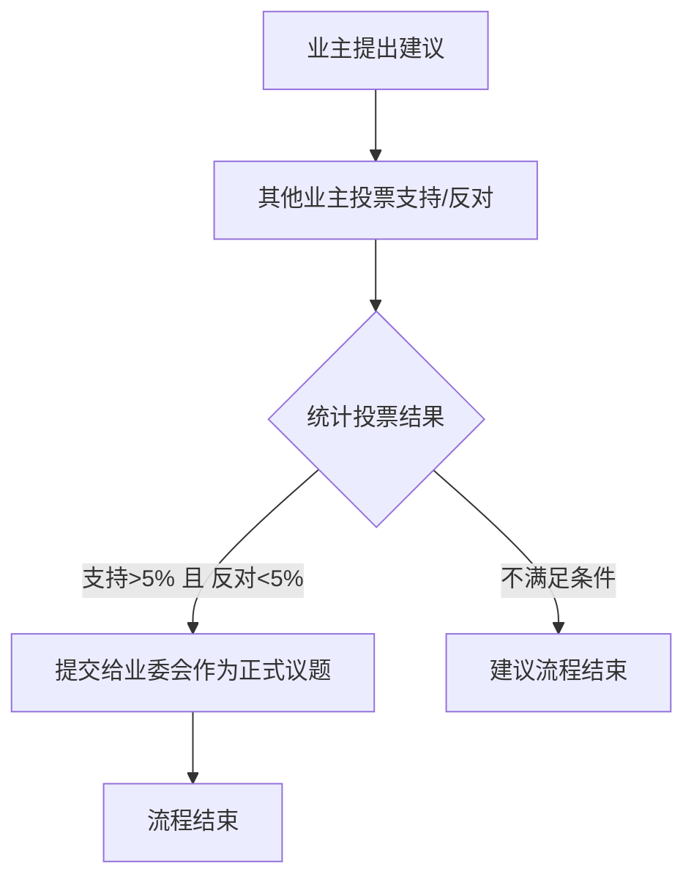
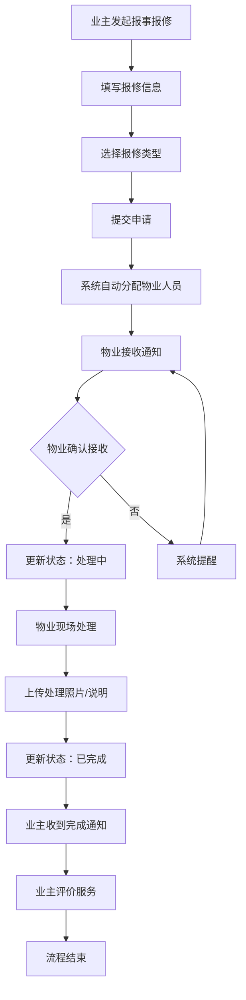
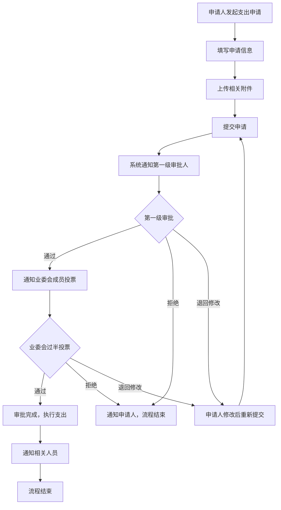
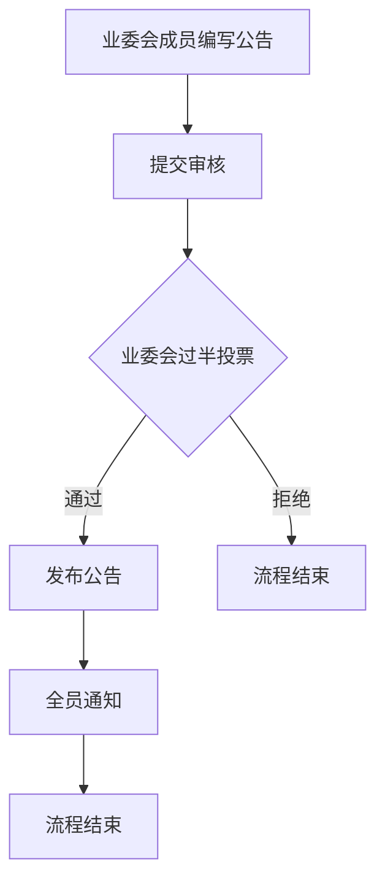
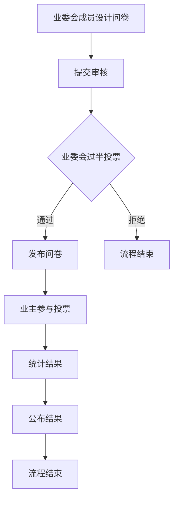

# 社区审批流程系统使用指南

## 概述

这套审批流程系统是专门为阳光花园社区管理应用设计的，符合中国物业管理条例中业委会的工作规则。系统支持多种审批场景，包括业主建议、报事报修、业委会支出申请、用印申请、公告通知等。

## 业务需求分析

### 用户角色与权限
- **业主 (OWNER)**: 小区建议、报事报修
- **业委会成员 (COMMITTEE_MEMBER)**: 支出申请、用印申请、公告通知、发布问卷
- **物业人员 (PROPERTY_MANAGER)**: 处理报修、发布通知

### 业委会配置
- 业委会成员数量：从 Supabase users 表中 role='COMMITTEE_MEMBER' 的用户数量动态获取
- 过半数通过规则：总人数的一半以上（如7人需要4票通过）

## 系统架构

### 文件结构
```
src/
├── components/workflow/           # 审批流程相关组件
│   ├── SimpleApprovalFlow.tsx    # 审批流程展示组件
│   ├── ApprovalActions.tsx       # 审批操作按钮组件
│   └── CommitteeVoting.tsx       # 业委会投票组件
├── hooks/
│   └── useApprovalFlow.ts        # 审批流程业务逻辑
└── pages/
    └── ApprovalCenter.tsx        # 审批中心完整页面
```

## 组件详细说明

### 1. useApprovalFlow.ts - 核心业务逻辑

**作用**: 这是整个审批系统的"大脑"，管理所有审批流程的状态和业务逻辑。

**主要功能**:
- 创建不同类型的审批流程（维修、支出、公告等）
- 管理投票流程（业委会过半数通过）
- 处理公示流程（7天公示期）
- 跟踪审批进度和状态

**预定义的流程类型**:
- `community_suggestion`: 小区建议流程（业主发起，其他业主投票支持）
- `repair_report`: 报事报修流程（业主发起，物业处理）
- `expense_application`: 支出申请流程（分级审批+业委会过半投票）
- `seal_application`: 用印申请流程（分级审批+业委会过半投票）
- `announcement`: 公告通知流程（业委会过半投票）
- `consultation`: 发布问卷流程（业委会过半投票）

### 2. SimpleApprovalFlow.tsx - 流程展示组件

**作用**: 以时间线的形式展示审批流程的各个步骤和当前状态。

**特点**:
- 移动端友好的设计
- 清晰的状态图标（✓ 已完成、⏰ 进行中、✗ 已拒绝）
- 支持点击查看详情
- 显示负责人和完成时间

### 3. CommitteeVoting.tsx - 业委会投票组件

**作用**: 专门处理业委会集体决策的投票功能。

**符合法规要求**:
- 过半数通过机制
- 投票进度实时显示
- 支持赞成/反对/弃权三种选择
- 投票截止时间管理
- 投票记录可追溯

### 4. ApprovalActions.tsx - 操作按钮组件

**作用**: 提供审批操作的用户界面（通过/拒绝/备注）。

**特点**:
- 权限控制（只有相关人员能操作）
- 拒绝时必须填写原因
- 支持添加备注说明

### 5. ApprovalCenter.tsx - 完整页面

**作用**: 整合所有组件，提供完整的审批中心页面。

**功能**:
- 待处理/已完成/全部三个标签页
- 显示用户的待办任务数量
- 集成所有审批组件

## 使用方式说明

### 集成到现有页面

**审批流程功能已集成到 `/src/pages/Participate.tsx` 页面中**，通过流程功能网格提供入口：

#### 现有入口配置
```typescript
// 在 Participate.tsx 中已配置的流程入口
const processFunctions = [
  // 业委会功能
  { id: 'expense_application', title: '支出申请', route: '/expense-application' },
  { id: 'seal_application', title: '用印申请', route: '/seal-application' },
  { id: 'announcement', title: '公告通知', route: '/announcement' },
  { id: 'consultation', title: '发布问卷', route: '/consultation' },
  
  // 业主功能
  { id: 'community_suggestion', title: '小区建议', route: '/community-suggestion' },
  { id: 'repair_report', title: '报事报修', route: '/repair-report' },
  
  // 物业功能
  { id: 'notice_publish', title: '通知发布', route: '/notice-publish' }
];
```

#### 组件使用场景

**场景1：流程发起页面**
```typescript
// 各个流程的发起页面（如 /expense-application）
import { useApprovalFlow } from '../hooks/useApprovalFlow';

function ExpenseApplicationPage() {
  const { createWorkflow } = useApprovalFlow();
  
  const handleSubmit = (formData) => {
    createWorkflow('expense_application', formData.title, formData.description, currentUser.id);
  };
  
  return (
    <form onSubmit={handleSubmit}>
      {/* 表单内容 */}
    </form>
  );
}
```

**场景2：审批处理页面**
```typescript
// 在待办事项中显示审批流程
import { SimpleApprovalFlow } from '../components/workflow/SimpleApprovalFlow';
import { CommitteeVoting } from '../components/workflow/CommitteeVoting';

function TodoDetailPage() {
  const { workflows, voteOnStep } = useApprovalFlow();
  
  return (
    <div>
      <SimpleApprovalFlow steps={workflow.steps} workflowType="expense_application" />
      {needsVoting && (
        <CommitteeVoting
          stepId={currentStep.id}
          workflowId={workflow.id}
          voteConfig={currentStep.voteConfig}
          onVote={voteOnStep}
        />
      )}
    </div>
  );
}
```

**场景3：嵌入到事件详情**
```typescript
// 在事件详情页显示相关的审批流程
function EventDetailPage() {
  return (
    <div>
      <h2>事件详情</h2>
      <SimpleApprovalFlow 
        steps={relatedWorkflow.steps}
        workflowType="repair_report"
      />
    </div>
  );
}
```

## 开发实施步骤

### 第一阶段：路由页面创建
根据 Participate.tsx 中的路由配置，需要创建以下页面：

1. **业委会功能页面**
   - `/expense-application` - 支出申请页面
   - `/seal-application` - 用印申请页面  
   - `/announcement` - 公告通知页面
   - `/consultation` - 发布问卷页面

2. **业主功能页面**
   - `/community-suggestion` - 小区建议页面
   - `/repair-report` - 报事报修页面

3. **物业功能页面**
   - `/notice-publish` - 通知发布页面

### 第二阶段：业务逻辑实现
1. **更新流程模板**: 根据具体业务需求修改 `useApprovalFlow.ts` 中的工作流模板
2. **集成 Supabase**: 
   - 从 users 表动态获取业委会成员数量
   - 保存审批流程数据
   - 实现实时通知功能
3. **权限控制**: 根据用户角色控制功能访问

### 第三阶段：UI 组件集成
1. **表单页面**: 使用现有的表单组件创建各类申请页面
2. **审批展示**: 在待办事项中集成 `SimpleApprovalFlow` 组件
3. **投票功能**: 在需要投票的流程中集成 `CommitteeVoting` 组件
4. **通知提醒**: 集成到现有的消息通知系统

### 第四阶段：数据持久化和优化
1. **数据库设计**: 设计审批流程相关的数据表结构
2. **实时更新**: 使用 Supabase 实时订阅功能
3. **性能优化**: 缓存常用数据，优化查询性能
4. **审计日志**: 记录所有审批操作的历史记录

## 具体业务流程

### 1. 小区建议流程


**触发条件**: 支持人数超过小区总户数5% 且反对者少于5%

### 2. 报事报修流程


### 3. 支出申请流程（分级审批）


### 4. 用印申请流程
与支出申请流程相同，采用分级审批模式：
1. 第一级专员审批
2. 业委会过半数投票
3. 通过后执行用印

### 5. 公告通知流程


### 6. 发布问卷流程


## 配置说明

### 业委会成员动态配置
```typescript
// 从 Supabase 获取业委会成员数量
const getCommitteeMembers = async () => {
  const { data, error } = await supabase
    .from('users')
    .select('*')
    .eq('role', 'COMMITTEE_MEMBER');
  
  return data?.length || 0;
};

// 动态计算过半数
const getRequiredVotes = (totalMembers: number) => {
  return Math.floor(totalMembers / 2) + 1;
};
```

### 小区建议投票配置
```typescript
// 小区建议的投票阈值配置
suggestionVoteConfig: {
  supportThreshold: 0.05,    // 支持率阈值 5%
  oppositionThreshold: 0.05, // 反对率阈值 5%
  totalHouseholds: 0,        // 从数据库获取总户数
  currentSupport: 0,         // 当前支持数
  currentOpposition: 0       // 当前反对数
}
```

### 报修流程配置
```typescript
repairConfig: {
  autoAssignment: true,      // 自动分配物业人员
  requirePhotos: true,       // 要求上传处理照片
  allowRating: true,         // 允许业主评价
  reminderInterval: 24       // 提醒间隔（小时）
}
```

### 分级审批配置
```typescript
hierarchicalApproval: {
  firstLevel: {
    role: 'COMMITTEE_SPECIALIST', // 第一级审批人角色
    required: true
  },
  secondLevel: {
    type: 'committee_vote',       // 第二级为业委会投票
    requiredVotes: 'majority'     // 过半数通过
  }
}
```

## 注意事项

### 1. 权限控制
- 不同角色看到不同的操作按钮
- 业委会成员才能参与投票
- 物业人员处理维修类流程

### 2. 状态管理
- 使用 `useApprovalFlow` 统一管理所有审批状态
- 避免直接修改组件内部状态

### 3. 移动端适配
- 所有组件都针对移动端优化
- 使用 Tailwind CSS 响应式设计
- 支持触摸操作

### 4. 扩展性
- 可以轻松添加新的流程类型
- 组件设计支持自定义样式
- 业务逻辑与UI分离

## 常见问题

**Q: 如何添加新的审批流程类型？**
A: 在 `useApprovalFlow.ts` 的 `workflowTemplates` 中添加新的模板定义，并在 `Participate.tsx` 中添加对应的入口按钮。

**Q: 业委会成员数量如何动态获取？**
A: 系统会从 Supabase users 表中查询 role='COMMITTEE_MEMBER' 的用户数量，自动计算过半数投票要求。

**Q: 小区建议的5%阈值如何计算？**
A: 需要先从数据库获取小区总户数，然后计算支持人数是否超过总户数的5%，反对人数是否少于5%。

**Q: 分级审批的第一级审批人如何确定？**
A: 可以在用户表中设置专门的角色（如 COMMITTEE_SPECIALIST），或者通过配置指定特定的用户作为第一级审批人。

**Q: 报修流程如何自动分配物业人员？**
A: 可以根据报修类型、区域等条件，从物业人员中自动选择合适的处理人员，或者采用轮询分配机制。

**Q: 如何处理投票截止时间？**
A: 系统支持设置投票截止时间，超时后自动结束投票并根据当前结果判断是否通过。

**Q: 审批流程的历史记录如何查看？**
A: 所有审批操作都会记录在数据库中，可以通过审批中心或事件详情页面查看完整的流程历史。

## 总结

这套审批流程系统完全基于你提供的具体业务需求设计，**所有组件需要组合使用**来实现完整的社区管理功能。

### 产品经理需要关注的要点：

1. **流程入口已就绪**: Participate.tsx 页面已经预留了所有流程功能的入口按钮
2. **权限分级清晰**: 不同角色看到不同的功能选项，符合实际使用场景
3. **投票规则明确**: 
   - 小区建议：支持>5%且反对<5%
   - 业委会决策：过半数通过
   - 分级审批：专员初审+业委会投票
4. **数据来源确定**: 业委会成员数量从 Supabase users 表动态获取

### 下一步工作：

1. **与开发团队确认**: 各个路由页面的具体实现方案
2. **数据库设计**: 确认审批流程相关的数据表结构
3. **用户测试**: 验证各个流程的用户体验是否符合预期
4. **权限配置**: 确定第一级审批人的具体人选和配置方式

### 技术实现优先级：

**高优先级**:
- 报事报修流程（使用频率最高）
- 小区建议流程（业主参与度高）

**中优先级**:
- 支出申请和用印申请（业委会核心功能）
- 公告通知功能

**低优先级**:
- 发布问卷功能（可后续迭代添加）

这套系统设计完全符合你的业务需求，可以直接指导开发团队进行实施。